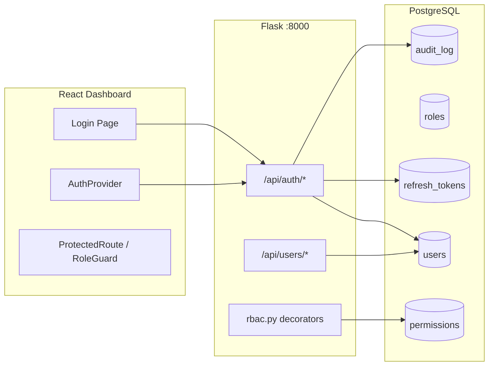
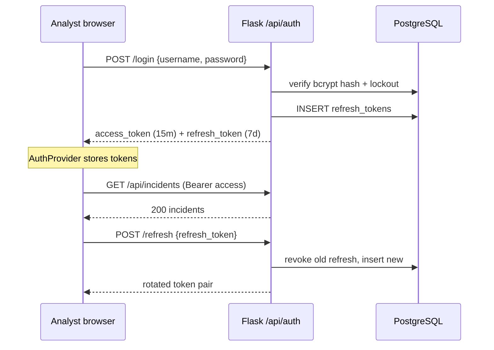
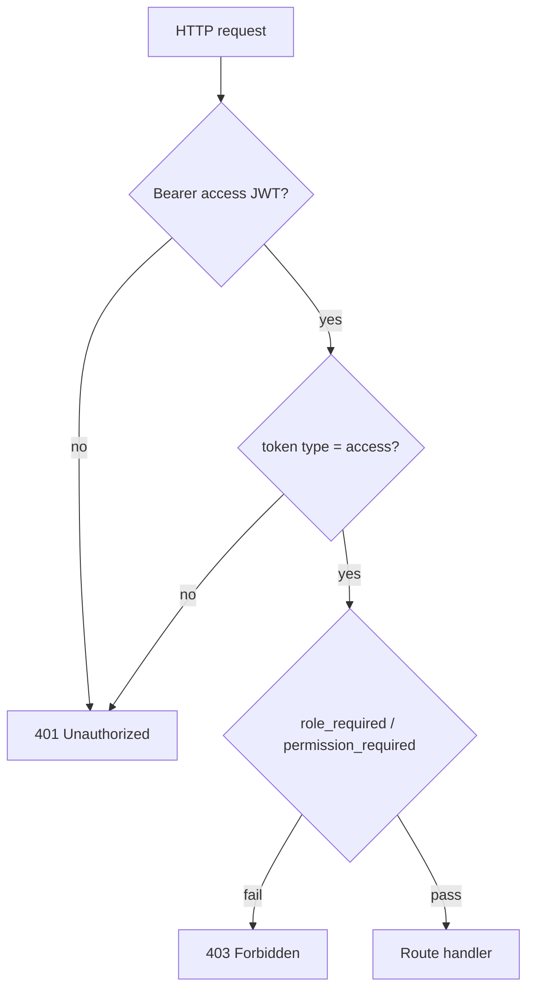
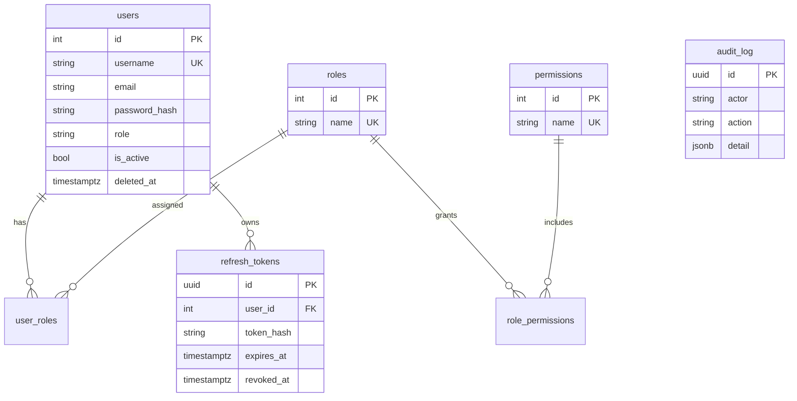

# SecuriSphere Authentication & Authorization

JWT-based authentication with Role-Based Access Control (RBAC) for the Flask gateway, FastAPI BFF, React dashboard, and PostgreSQL user store.

---

## Architecture



---

## Authentication flow



---

## Authorization flow



---

## Roles

| Role | Capabilities |
|------|----------------|
| **admin** | User management, system settings, audit logs, alerts, all analyst capabilities |
| **analyst** | Incidents, campaigns, MITRE, replay, reports, evaluation |
| **viewer** | Read-only dashboard, events, incidents, topology, risk |

Permissions are enumerated in `backend/api/rbac.py` and mirrored in `frontend/src/lib/rbac.js`.

---

## Database schema



Migration: `scripts/migrations/007_rbac_auth.sql`

---

## API reference

Base path: `/api/auth` and `/api/users` (Flask gateway).

### POST `/api/auth/login`

**Request**
```json
{ "username": "admin", "password": "ChangeMe123" }
```

**Response 200**
```json
{
  "success": true,
  "access_token": "<jwt>",
  "refresh_token": "<opaque>",
  "expires_in": 900,
  "user": {
    "id": 1,
    "username": "admin",
    "role": "admin",
    "permissions": ["users.manage", "incidents.read", "..."]
  }
}
```

Rate limited: `RATE_LIMIT_LOGIN` (default `10/minute`).

### POST `/api/auth/refresh`

**Request**
```json
{ "refresh_token": "<opaque>" }
```

**Response 200** — new access + refresh pair; old refresh revoked (rotation).

### POST `/api/auth/logout`

Requires `Authorization: Bearer <access>`. Revokes access token (blocklist).

### GET `/api/auth/me`

Returns current user + permissions from access JWT.

### GET `/api/users` — admin only

### POST `/api/users` — admin only

```json
{ "username": "jlee", "email": "jlee@soc.local", "password": "Analyst123", "role": "analyst" }
```

### PUT `/api/users/:id` — admin only

### DELETE `/api/users/:id` — admin only (soft delete)

---

## Environment variables

| Variable | Default | Purpose |
|----------|---------|---------|
| `JWT_SECRET` | required | HS256 signing key (≥16 chars prod) |
| `JWT_ACCESS_MINUTES` | `15` | Access token TTL |
| `JWT_REFRESH_DAYS` | `7` | Refresh token TTL |
| `ALLOW_PUBLIC_REGISTRATION` | `0` | Disable self-signup |
| `ADMIN_BOOTSTRAP_USER` | — | First admin username |
| `ADMIN_BOOTSTRAP_PASSWORD` | — | First admin password |
| `RATE_LIMIT_LOGIN` | `10/minute` | Login brute-force throttle |

---

## Security considerations

1. **bcrypt** (12 rounds) for password storage; legacy Werkzeug hashes auto-upgraded on login.
2. **Refresh rotation** — each refresh revokes the previous DB row (`replaced_by` chain).
3. **Account lockout** — 5 failed logins → 15-minute lock (`failed_attempts`, `locked_until`).
4. **Soft delete** — `deleted_at` on users; inactive accounts cannot authenticate.
5. **Process-local blocklist** — access tokens revoked on logout (single-worker demo; use Redis blocklist for multi-worker prod).
6. **Password policy** — ≥8 chars, letter + digit (extend in `_validate_password`).
7. **No OAuth/MFA** — intentional scope for capstone; JWT + RBAC only.

### Production recommendations

- Set strong `JWT_SECRET` via secrets manager, not `.env` in images.
- Enable `ALLOW_PUBLIC_REGISTRATION=0` (default).
- Terminate TLS at nginx; set `X-Forwarded-For` for audit IP accuracy.
- Move token blocklist to Redis for horizontal Flask scaling.
- Run migration `007_rbac_auth.sql` on deploy.
- Rotate `JWT_SECRET` with a planned session flush window.

---

## Frontend integration

| File | Purpose |
|------|---------|
| `contexts/AuthProvider.jsx` | Session state, auto-refresh |
| `components/auth/ProtectedRoute.jsx` | Route-level gate |
| `components/auth/RoleGuard.jsx` | UI element gate |
| `pages/UserManagement.jsx` | Admin user CRUD |
| `pages/Unauthorized.jsx` | 403 landing |
| `lib/rbac.js` | Permission + nav maps |

Navigation is filtered per role via `navItemsForRole()` in `navConfig.js`.
